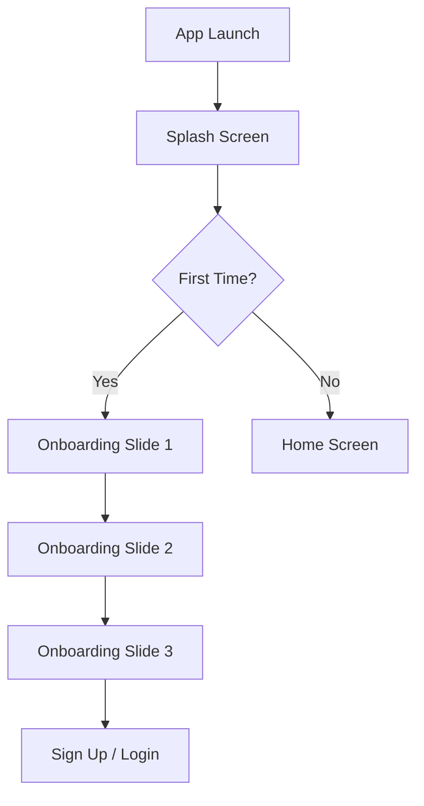
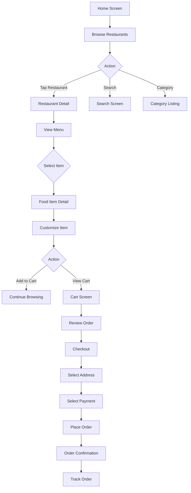

# Navigation Flows & User Journeys
## Food Delivery App

---

## Navigation Structure

### Primary Navigation (Bottom Tab Bar)

```
┌─────────────────────────────────────┐
│  Home    Search    Cart    Profile  │
└─────────────────────────────────────┘
```

**Tabs:**
1. **Home** - Main feed with restaurants and promotions
2. **Search** - Search for food, restaurants, cuisines
3. **Cart** - Current order and checkout
4. **Profile** - User account and settings

---

## Screen Hierarchy

```
App Root
├── Authentication Flow (Not logged in)
│   ├── Splash Screen
│   ├── Onboarding (3-4 screens)
│   ├── Login
│   ├── Sign Up
│   ├── Forgot Password
│   └── OTP Verification
│
└── Main App (Logged in)
    ├── Home Tab
    │   ├── Home Screen
    │   ├── Restaurant Detail
    │   ├── Food Item Detail
    │   └── Category Listing
    │
    ├── Search Tab
    │   ├── Search Screen
    │   └── Search Results
    │
    ├── Cart Tab
    │   ├── Cart Screen
    │   ├── Checkout Screen
    │   └── Order Success
    │
    └── Profile Tab
        ├── Profile Screen
        ├── Order History
        ├── Order Detail
        ├── Saved Addresses
        ├── Payment Methods
        ├── Favorites
        ├── Settings
        └── Help & Support
```

---

## User Flows

### 1. First Time User Flow (Onboarding)



**Steps:**
1. Launch app
2. Show splash screen (2-3 seconds)
3. Check if first time user
4. If first time:
   - Show onboarding slides (swipeable)
   - Allow skip button
   - Show progress indicators
   - Final slide has "Get Started" button
5. Navigate to Login/Sign Up
6. After authentication, go to Home

**Transition:** Slide left (forward), Slide right (back)
**Duration:** 300ms

---

### 2. Authentication Flow

#### Login Flow
```
Login Screen
  ├── Enter email/phone
  ├── Enter password
  ├── [Forgot Password?] → Forgot Password Screen
  │                          └── Enter email → OTP → Reset Password → Login
  ├── [Sign Up] → Sign Up Screen
  └── [Login] → Home Screen
```

**Steps:**
1. User enters credentials
2. Validate input (real-time)
3. On submit:
   - Show loading state
   - Call authentication API
   - Handle success → Navigate to Home
   - Handle error → Show error message
4. Store auth token
5. Navigate to Home with fade transition

#### Sign Up Flow
```
Sign Up Screen
  ├── Enter name
  ├── Enter email
  ├── Enter phone
  ├── Enter password
  ├── [Already have account?] → Login Screen
  └── [Sign Up] → OTP Verification → Home Screen
```

**Steps:**
1. User fills form
2. Validate each field on blur
3. On submit:
   - Show loading
   - Create account
   - Send OTP
4. Navigate to OTP screen
5. Verify OTP
6. Navigate to Home

---

### 3. Browse & Order Flow (Main Flow)



**Detailed Steps:**

#### Step 1: Home Screen → Restaurant
1. User scrolls through restaurants
2. Taps on a restaurant card
3. Transition: Scale up + fade (300ms)
4. Navigate to Restaurant Detail

#### Step 2: Restaurant Detail
1. Show hero image (parallax on scroll)
2. Display restaurant info:
   - Name, rating, delivery time, cuisine
   - Menu categories (sticky tabs)
   - Food items in categories
3. User can:
   - Scroll through menu
   - Tap food item → Food Detail
   - Add to favorites (heart icon)
   - View reviews
   - See restaurant info

#### Step 3: Food Item Detail
1. Show in modal/bottom sheet
2. Display:
   - Large food image
   - Name, description, price
   - Customization options (radio/checkbox)
   - Add-ons
   - Quantity selector
   - Special instructions (textarea)
3. User actions:
   - Adjust quantity (+/-)
   - Select options
   - Add to cart
4. On "Add to Cart":
   - Show success animation
   - Update cart badge
   - Dismiss modal
   - Optional: Show cart preview (toast/snackbar)

#### Step 4: Cart Screen
1. Display:
   - List of items
   - Item details (name, customizations, price)
   - Quantity adjusters
   - Remove item option (swipe left)
   - Subtotal
   - Delivery fee
   - Taxes
   - Total
   - Promo code input
2. User actions:
   - Adjust quantities
   - Remove items
   - Apply promo code
   - Proceed to checkout

#### Step 5: Checkout Flow
```
Cart Screen
  └── [Checkout] → Checkout Screen
                    ├── Delivery Address
                    │   ├── Select saved address
                    │   └── [Add New] → Add Address Form → Save → Back
                    ├── Delivery Instructions (optional)
                    ├── Payment Method
                    │   ├── Select saved card
                    │   ├── Cash on Delivery
                    │   └── [Add New] → Add Payment Form → Save → Back
                    ├── Tip (optional)
                    └── [Place Order] → Processing → Order Success
```

**Steps:**
1. Review delivery address
   - If no address, prompt to add
   - Can select from saved addresses
   - Can add new address
2. Add delivery instructions (optional)
3. Select payment method
   - Saved cards
   - New card
   - Cash on delivery
   - Digital wallets
4. Add tip (optional suggestions)
5. Review order summary
6. Place order:
   - Show loading overlay
   - Process payment
   - Create order
7. Navigate to Order Success screen

#### Step 6: Order Success & Tracking
1. Show success animation (checkmark)
2. Display order number
3. Estimated delivery time
4. Button to track order
5. Navigate to Order Tracking:
   - Order status timeline
   - Driver info (name, photo, rating)
   - Live map with driver location
   - ETA countdown
   - Contact buttons (call/message)
6. Push notifications for status updates

---

### 4. Search Flow

```
Search Tab → Search Screen
              ├── Recent Searches (chips)
              ├── Popular Cuisines (chips)
              ├── Search Input
              └── [Type query] → Search Results
                                  ├── Restaurants
                                  ├── Dishes
                                  └── Cuisines
```

**Steps:**
1. Tap on search input
2. Show keyboard
3. Display suggestions as user types (debounced)
4. Categories: Restaurants, Dishes, Cuisines
5. Tap result → Navigate to detail
6. Save to recent searches

**Features:**
- Auto-complete
- Spell correction suggestions
- Voice search (optional)
- Filters (cuisine, rating, delivery time, price)
- Sort options

---

### 5. Profile & Settings Flow

```
Profile Tab → Profile Screen
              ├── User Info
              ├── [Order History] → Order History List
              │                      └── [Order] → Order Detail
              │                                     ├── Reorder
              │                                     ├── Rate Order
              │                                     └── Help with Order
              ├── [Addresses] → Saved Addresses
              │                  ├── [Edit] → Edit Address Form
              │                  ├── [Delete] → Confirm Dialog
              │                  └── [Add New] → Add Address Form
              ├── [Payment Methods] → Saved Payment Methods
              │                        ├── [Edit] → Edit Payment
              │                        ├── [Delete] → Confirm Dialog
              │                        └── [Add New] → Add Payment Form
              ├── [Favorites] → Favorites List
              ├── [Settings] → Settings Screen
              │                 ├── Notifications
              │                 ├── Language
              │                 ├── Currency
              │                 ├── Dark Mode
              │                 └── Privacy
              ├── [Help & Support] → Help Screen
              │                       ├── FAQs
              │                       ├── Contact Support
              │                       └── Live Chat
              └── [Logout] → Confirm Dialog → Login Screen
```

---

## Navigation Patterns

### Modal Presentations
Used for:
- Food item detail
- Add address form
- Add payment method
- Filters
- Confirmation dialogs

**Animation:**
- Entry: Slide up from bottom (300ms)
- Exit: Slide down (300ms)
- Backdrop: Fade in/out

### Bottom Sheets
Used for:
- Quick actions
- Options menu
- Sort/filter options

**Animation:**
- Entry: Slide up with spring (400ms)
- Exit: Slide down (300ms)
- Swipe down to dismiss

### Push/Stack Navigation
Used for:
- Main screen transitions
- Hierarchical navigation

**Animation:**
- Forward: Slide left (300ms)
- Back: Slide right (300ms)

### Tab Navigation
Used for:
- Bottom navigation bar
- Category tabs in restaurant detail

**Animation:**
- Fade (200ms)
- No animation (instant switch)

---

## Back Navigation

### Android Back Button / iOS Swipe Back
- **Restaurant Detail** → Home
- **Food Detail Modal** → Dismiss modal (stay on restaurant)
- **Checkout** → Cart
- **Order Success** → Home (can't go back to checkout)
- **Search Results** → Search
- **Any Profile Screen** → Profile

### Header Back Button
- Always in top-left
- Icon: Left arrow
- Behavior: Same as system back

---

## Deep Linking

### Supported Deep Links
```
myapp://restaurant/{id}
myapp://food/{id}
myapp://order/{id}
myapp://promotion/{id}
myapp://category/{name}
```

**Behavior:**
1. Parse URL
2. If not logged in → Show login → Navigate to destination
3. If logged in → Navigate directly
4. Handle invalid/expired links → Show error → Navigate to home

---

## Push Notification Actions

### Order Status Updates
- **Tap:** Navigate to Order Tracking screen

### Promotions
- **Tap:** Navigate to specific restaurant/offer

### Rating Request
- **Tap:** Open rating modal

---

## Accessibility Navigation

### Keyboard Navigation (Web)
- Tab through interactive elements
- Enter/Space to activate
- Arrow keys for carousels/sliders
- Escape to close modals

### Screen Reader
- Clear navigation landmarks
- Proper heading hierarchy
- Descriptive link text
- Status announcements for dynamic content

### Voice Control
- Support voice commands for navigation
- "Go to cart"
- "Go back"
- "Open menu"

---

## Edge Cases & Error Handling

### Network Errors
- Show error message
- Provide retry button
- Cache data when possible
- Graceful degradation

### Authentication Expiry
- Detect expired token
- Show re-login modal
- Preserve current context
- Navigate back after login

### Empty States
- No restaurants available
- No search results
- Empty cart
- No order history
Each shows appropriate message + action button

### Permission Denials
- Location denied → Show manual address entry
- Notification denied → Show settings link

---

## Performance Considerations

### Lazy Loading
- Load tab content on first visit
- Lazy load images
- Infinite scroll for lists

### Preloading
- Preload next likely screen
- Preload common assets
- Cache recent data

### Optimistic Updates
- Update UI immediately
- Show loading for confirmation
- Rollback on error

---

## Analytics Events

Track navigation events:
- Screen views
- Button taps
- Modal opens/closes
- Time on screen
- Navigation paths
- Drop-off points

---

## Implementation Checklist

- [ ] Set up navigation library (React Navigation / Router)
- [ ] Define route names and parameters
- [ ] Implement authentication flow
- [ ] Implement main app navigation
- [ ] Add transition animations
- [ ] Handle deep links
- [ ] Handle push notifications
- [ ] Implement back navigation
- [ ] Add loading states
- [ ] Add error handling
- [ ] Test all navigation paths
- [ ] Test edge cases
- [ ] Verify accessibility
- [ ] Add analytics tracking

---

## Notes

**Last Updated:** 2025-10-11
**Status:** Template - awaiting Figma extraction
**Framework:** To be determined (React Native / Flutter / React Web)
